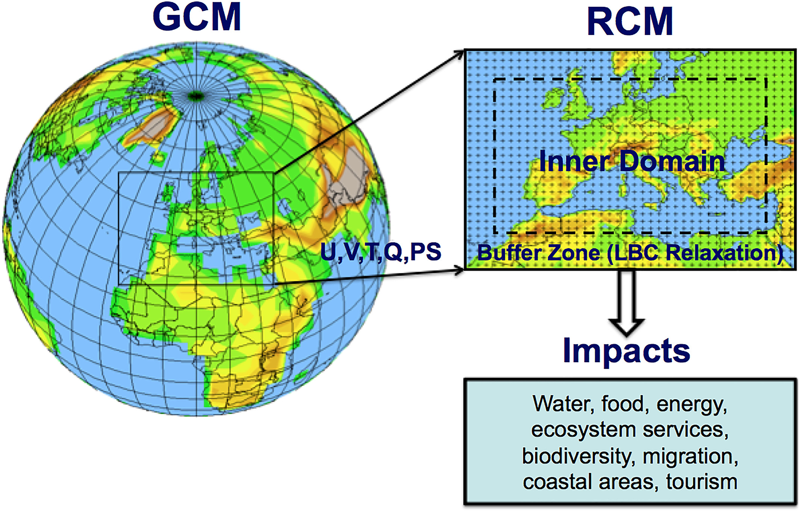

CSCI 596 
Final Project 
Fall 2020 
Joseph Ko

# Regional-scale Climate Modeling on HPC using WRF

## One-minute overview

### What is a climate model?

### What is WRF?

WRF = Weather Research and Forecasting Model 
- open-source, regional-scale climate model (ranging from ~city to continental scale)
- primarily developed/maintained by NCAR and NOAA
- more than 48,000 registered users worldwide
- Link to WRF repository: https://github.com/wrf-model/WRF

### Primary research question?

### How is this relevant to CSCI596?
- climate models -> computationally intensive -> need to run on supercomputers
- "...WRF is highly scalable and it can be run on extremely large core counts..." -[UCAR](https://www2.cisl.ucar.edu/resources/optimizing-wrf-performance)
- built-in MPI/OpenMP options
- GPU acceleration potential to be explored

Goal: Perform basic benchmarking and scaling analysis to figure out optimal resource allocation and configuration for my application(s).
