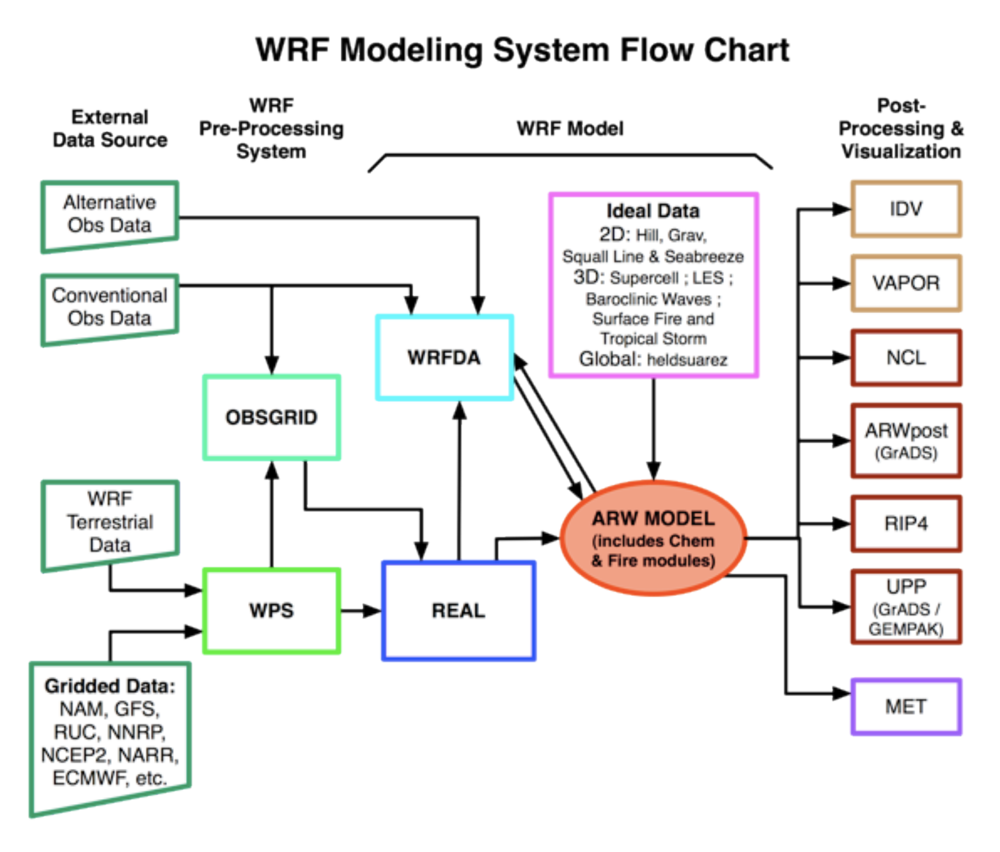

CSCI 596<br/>
Final Project<br/>
Fall 2020<br/>
Joseph Ko

# Regional-scale Climate Modeling on HPC using WRF

## (1) One-minute overview

### What is a climate model?


(image credit: [NOAA](https://www.climate.gov/file/atmosphericmodelschematicpng))

### What is WRF?
WRF = Weather Research and Forecasting Model 
- open-source, regional-scale climate model (ranging from ~city to continental scale)
- primarily developed/maintained by NCAR and NOAA
- more than 48,000 registered users worldwide
- Link to WRF repository: https://github.com/wrf-model/WRF


(image credit: [Filippo Giorgi](https://agupubs.onlinelibrary.wiley.com/doi/10.1029/2018JD030094))

### Primary research question?
How much does anthropogenic waste heat (e.g., heat from AC, vehicles, industry) contribute to the urban heat island in the Los Angeles Basin?


(image credit: [Germany's National Meteorological Service](https://www.dwd.de/EN/research/climateenvironment/climate_impact/urbanism/urban_heat_island/urbanheatisland_node.html))

### How is this relevant to CSCI596?
- climate models -> computationally intensive -> need to run on supercomputers
- "...WRF is highly scalable and it can be run on extremely large core counts..." -[UCAR](https://www2.cisl.ucar.edu/resources/optimizing-wrf-performance)
- built-in MPI/OpenMP options
- GPU acceleration potential to be explored

Goal: Perform basic benchmarking and scaling analysis to figure out optimal resource allocation and configuration for my application(s).

## (2) Formal research proposal

The urban heat island (UHI) is an observed phenomena that describes elevated temperatures in urban areas compared to the surrounding rural areas. The UHI is caused by the extensive use of thermally massive materials in urban environments, as well as anthropogenic heat flux (AHF). Extreme heat events are responsible for more deaths in the United States than any other weather related disaster. With the coupling of global climate change and the overall increasing population in urban areas, there is an urgent need to target efficient and effective methods of urban heat mitigation. Although a limited body of work has shown that AHF (e.g., air conditioning waste heat and heat from vehicles) contributes to the UHI in a non-negligible manner, the exact quantification of its contribution remains ambiguous. In this work, we will use the Weather Research and Forecasting Model (WRF) on the USC HPC to put quantitative bounds on the contribution of AHF to the UHI in the Greater Los Angeles region. This modeling will allow us to quantify the AHF in higher temporal and spatial scale than previous works, which have reported highly variable results. Narrowing the uncertainty in the role of AHF on urban temperatures is crucial for policy makers to lead efficient efforts in making Los Angeles a more habitable city under future climate change.

## (3) Compiling and running: sample overview



(image credit: NCAR ARW Users Guide)

### (3.1) What you need 

- Intel compiler
- NetCDF
- WRF modeling system software i.e., the model code (https://github.com/wrf-model/WRF)
- some version of mpich
- OpenMP
- compilers: gfortran, cpp, gcc
- scripting languages needed: csh, perl, sh

### (3.2) Configure and compile
```
salloc --ntasks=1 --time=1:00:00 --partition=banweiss

source /usr/usc/netcdf/4.3.3.1/setup.sh
source /usr/usc/intel/19.0.2/setup.sh
source /usr/usc/openmpi/1.8.8/setup.sh.intel
export WRFIO_NCD_LARGE_FILE_SUPPORT=1
export WRF_EM_CORE=1
export EM_CORE=1 
export WRF_NMM_CORE=0
export NMM_CORE=0
export WRF_CHEM=1

vi ./arch/Config_new.pl set
$I_really_want_to_output_grib2_from_WRF="TRUE" # was FALSE
./configure # choose option 15 (dmpar (mpi, communication between cores), INTEL (ifort/icc))
cp configure.wrf.backup configure.wrf
build_wrf.slurm (./compile em_real >& compile_em_real.log1)
sbatch build_wrf.slurm
```

### (3.3) WRF Pre-processing System (WPS)
```
vim namelist.wps
./geogrid.exe # generate geo.d0*_ ...
ln -sf ./ungrib/Variable_Tables/Vtable.NARR Vtable
./link_grib.csh /home/rcf-proj2/gab3/yli272/NARR_data/NARR_datafiles/datafile_2012/*
# Copy fixed file
./ungrib.exe
./metgrid.exe (generate met_em.d0*)
```

### (3.4) WRF input files
```
ln -s {WPS directory}/met_em* .
vim namelist.input #(https://esrl.noaa.gov/gsd/wrfportal/namelist_input_options.html)
sbatch runreal_modified.slurm (./real.exe)
```

### (3.5) Run WRF
```
sbatch runwrf.slurm(./wrf.exe)
wrfout_d0* #(vi Registry/Registry.EM_COMMON for variable naming)
wrfrst_d0*
rsl.out.* & rsl.error.* (tail -n 30 rsl.out.0000)
```
## (4) Examples of past WRF applications

insert two figures from group work

## (5) Performance benchmarking and scaling analysis

