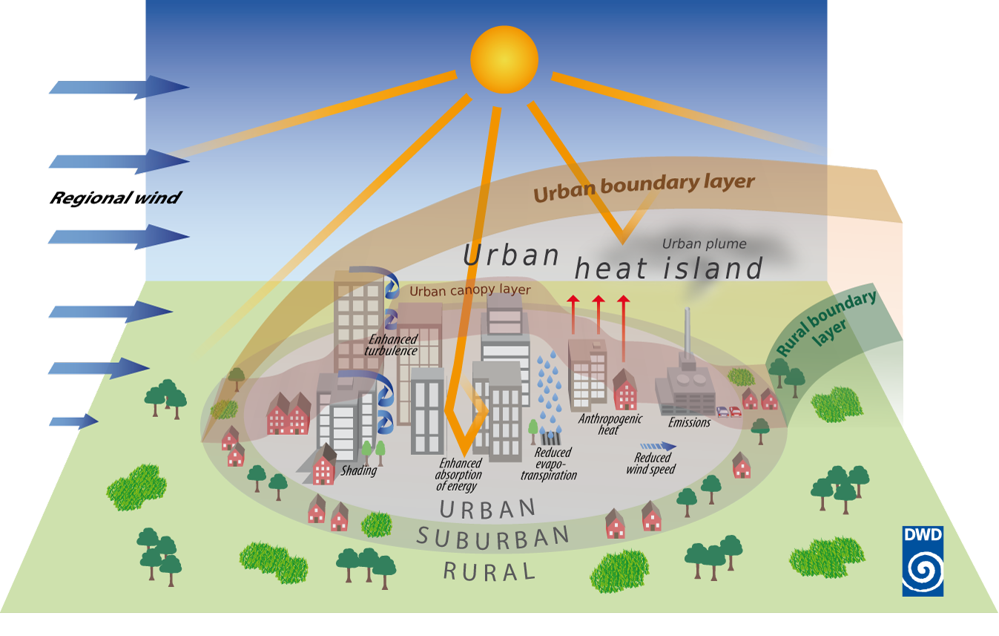

CSCI 596 
Final Project 
Fall 2020 
Joseph Ko

# Regional-scale Climate Modeling on HPC using WRF

## One-minute overview

### What is a climate model?

(image credit: [NOAA](https://www.climate.gov/file/atmosphericmodelschematicpng))

### What is WRF?
WRF = Weather Research and Forecasting Model 
- open-source, regional-scale climate model (ranging from ~city to continental scale)
- primarily developed/maintained by NCAR and NOAA
- more than 48,000 registered users worldwide
- Link to WRF repository: https://github.com/wrf-model/WRF

(image credit: [Filippo Giorgi](https://agupubs.onlinelibrary.wiley.com/doi/10.1029/2018JD030094))

### Primary research question?
How much does anthropogenic waste heat (e.g., heat from AC, vehicles, industry) contribute to the urban heat island in the Los Angeles Basin?

(image credit: [Germany's National Meteorological Service](https://www.dwd.de/EN/research/climateenvironment/climate_impact/urbanism/urban_heat_island/urbanheatisland_node.html))

### How is this relevant to CSCI596?
- climate models -> computationally intensive -> need to run on supercomputers
- "...WRF is highly scalable and it can be run on extremely large core counts..." -[UCAR](https://www2.cisl.ucar.edu/resources/optimizing-wrf-performance)
- built-in MPI/OpenMP options
- GPU acceleration potential to be explored

Goal: Perform basic benchmarking and scaling analysis to figure out optimal resource allocation and configuration for my application(s).
